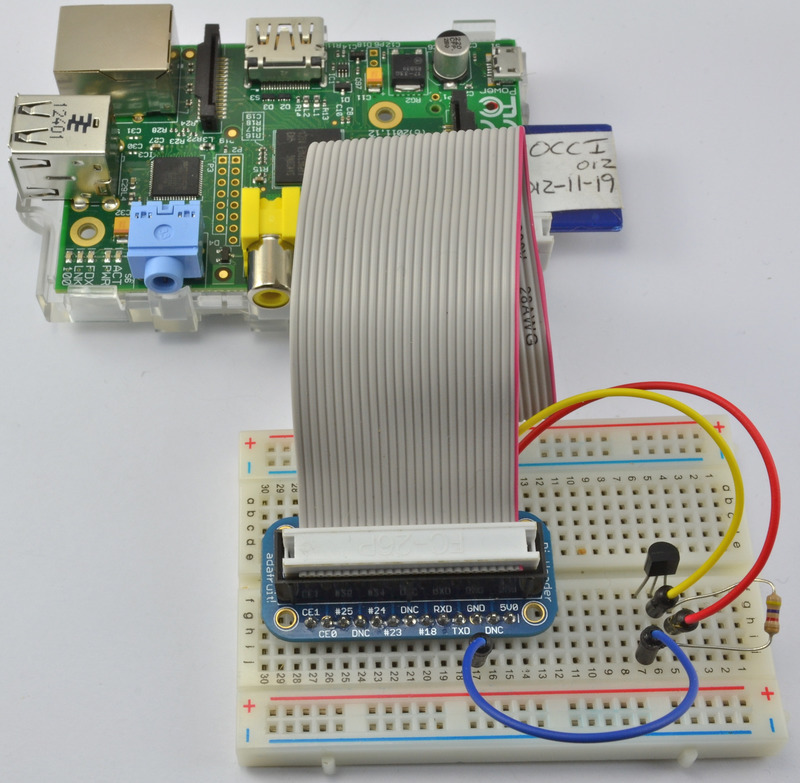
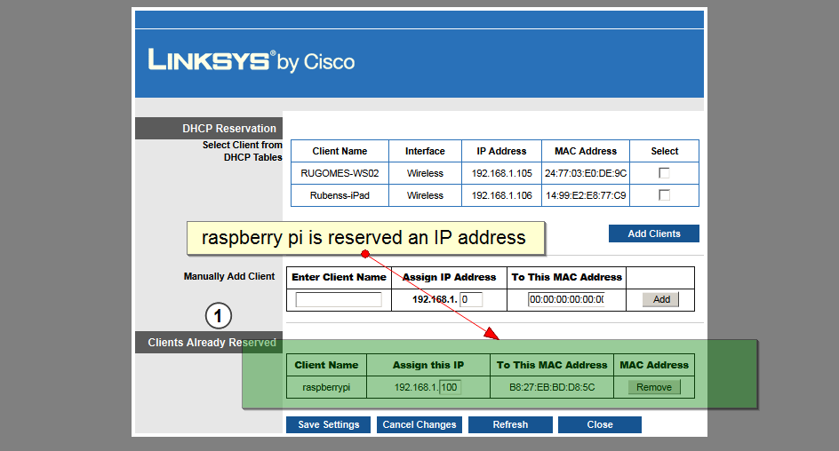
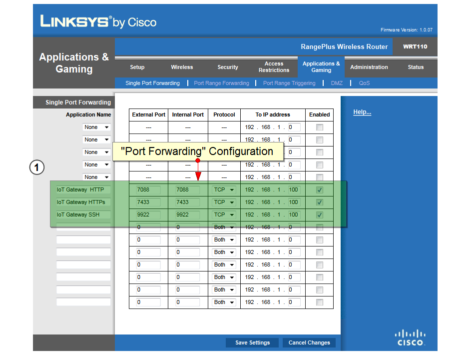

# IoT - Internet of Things

This is a sample IoT project that consists of reading a temperature sensor
in Rubens' home.

The temperature is provided by the DS18B20 digital sensor from Dallas
Semiconductor.  The sensor is installed on a breadboard which connects thru
wiring to a Raspberry PI 2 Model B SBC (Single Board Computer). See image
below:

In order to expose the sensor data to the Internet, a RESTFul API is
implemented on the Raspberry Pi SBC which is connected to the home Internet
router.

# Project Set Up

## Raspberry Pi 2 Model B Set Up

A raspbian image was downloaded from
[Raspberry Pi Site](http://www.raspberrypi.org/downloads/), and installed on
a 16 GB microSDHC card (Model No. "SDSDQUA-016G-U46A" from SanDisk.  The micro
SD card was then used to do the initial Raspberry Pi boot.

During the initial Raspberry PI boo, changes were done to locale, keyboard,
timezone, enable ssh, hostname and password.  After reboot, the system was
updated by running the following command:

    sudo apt-get update

## Raspberry Pi 2 Model Sensor Settings

The following configuration were applied on the following Raspberry Pi files.

/boot/config.txt:

added the following line to allow DS18B20 to connect to GPIO#4

    dtoverlay=w1-gpio

/etc/modules:

device drivers required to drive the DS18B20 Temperature Sensor

    wire
    w1_gpio
    w1_therm

## Home Router Configuration

The home Internet router should be configured with DHCP Reservation to reserve
an IP address for the IoT Gateway host computer - Raspberry PI.

Below is an image of my router DHCP Reservation configuration.

The home Internet router should also be configured with "Port Forwarding" to
allow incoming HTTP and HTTPs (SSL) connections to the router to be forwarded
to the IoT gateway server - Raspberry PI.  For security reasons you should
**not** use the default HTTP (port 80) or default HTTPS (port 443) for your
Home IoT Gateway server.

Below is an image of my router Port Forwarding configuration.

## Temperature Sensor - DS18B20

In this IoT project we use the Dallas Semiconductor DS18B20 digital temperature
sensor.  This sensor is physically connected to the Raspberry Pi SBC (Single
Computer Board) thru its GPIO (General Purpose Input-Output) interface
connector.

## Dynamic DNS Name for Home Router

The services of [Duck DNS](http://www.duckdns.org/) have been used to configure
the following names to point to the home router public IP address.

* iotgw.duckdns.org
* iotsensor.duckdns.org

## Python Sensor Device Driver Library

The software connection to read the data off the DS18B20 temperature sensor is
done using the Python device "w1thermsensor driver.  The link to the Python
driver source code can be found in the link below.

[Python DS18B20 Driver](https://github.com/timofurrer/w1thermsensor)

## Project Source Code

The source code for this project including the sensor RESTFul API and the
device driver code can be found in the following GitHub repository:

[flaskapis](https://github.com/rubensgomes/flaskapis)

## Required Software

apache2 httpd which can be installed as follows:

    sudo apt-get install apache2 -y
    sudo apt-get install apache2-threaded-dev

SQLite 3

    sudo apt-get install sqlite3

Python Dev Environment, Python pip, Python virtualenv

    sudo apt-get install python-dev
    sudo apt-get install python-pip
    sudo pip install virtualenv

## UNIX, Apache HTTP/HTTPs (SSL) and Python Environment

### UNIX Environment

Create "wsgi" user with home directory "/home/wsgi"

Create directory "/home/wsgi/flaskapis" where the Python application virtual
environment is created and the sensor source code is deployed.

copy application.cfg from "flaskapsis" to "/home/wsgi/flaskapis".  Then,
change the properties of application.cfg accordingly

copy flaskapis.wsgi from "flaskapis" to "/home/wsgi/flaskapis".

create SQLite database named "flaskapis.db" in the "/home/wsgi/flaskapis".
Then, use the flaskapis/db/db_schema.sql to set up the database schema.

### Python Virtual Environment

Set up a Python virtual environment in the "/home/wsgi/flaskapis/venv" folder.
Then, install Flask, flask-restful, w1thermsensor, pint, flufl.enum,
validate-email,..., packages in the virtual environment.

    cd /home/wsgi/flaskapis
    virtualenv venv
    source /home/wsgi/flaskapis/venv/bin/activate
    pip install Flask
    pip install flask-restful
    pip install pint
    pip install validate-email
    pip install flufl.enum
    pip install w1thermsensor
    pip install paho-mqtt

    deactivate

### Apache Configuration

Some of the relevant Apache configuration may be found in the
[apache2 folder] (/misc/config/iotgw/etc/apache2).

### SSL Certificate Configuration

The RESTFul API to the sensor temperature is protected by SSL (Security Socket
Layer) and HTTP Basic Authentication.  It is therefore necessary to generate and
configure a self-signed (snakeoil) certificate in apache 2.

There is no need to have a CA (Certification Authority) SSL certificate because
the domain of the IOT-GW home device (Raspberry Pi) is a private domain.

Some of the relevant SSL apache2 configuration may be found in the
[apache2 folder] (/misc/config/iotgw/etc/apache2).

